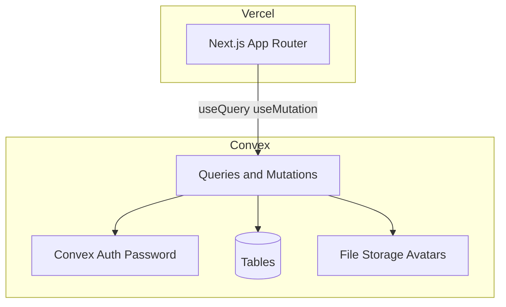

# Video Editing Tracker Implementation Plan

> **Note:** The `/write-plan` Cursor command is deprecated; this plan follows the **superpowers:writing-plans** skill instead.

> **For agentic workers:** REQUIRED SUB-SKILL: Use superpowers:subagent-driven-development (recommended) or superpowers:executing-plans to implement this plan task-by-task.

**Goal:** A Vercel-hosted web app where signed-up users register videos (storage path + optional YouTube link), track editing status, comment on in-progress edits, manage version history, and manage profiles—with admin-only user elevation and restricted video deletion.

**Architecture:** Next.js App Router frontend on Vercel talks to a Convex backend for real-time data, auth, and avatar file storage. Videos are **metadata-only** (no video file uploads); each video stores a `storagePath` string and optional `youtubeUrl`. Comments are scoped to videos in `in_progress` status. Authorization is enforced server-side in Convex mutations/queries via custom auth wrappers.

**Tech Stack:** Next.js 15 (App Router), TypeScript, Tailwind CSS, shadcn/ui, Convex (database + real-time + file storage), `@convex-dev/auth` (email/password signup), Vercel deployment

**Confirmed requirements from you:**
- Metadata-only video tracking with filesystem directory/path displayed
- Optional YouTube link per video/version
- Any signed-up user can register videos
- Comments on videos currently being edited
- Version history for edited videos
- Signup/login; users change password, username, avatar
- Only admin or uploader can delete a video
- Admin can promote users to admin

---

## System Architecture



## Data Model

### [`convex/schema.ts`](convex/schema.ts)

| Table | Purpose | Key fields |
|-------|---------|------------|
| `users` | Profile + roles (extends Convex Auth) | `username`, `role` (`user` \| `admin`), `avatarStorageId?`, `tokenIdentifier` |
| `videos` | Editing projects | `title`, `storagePath`, `youtubeUrl?`, `status` (`to_edit` \| `in_progress` \| `completed`), `createdBy`, `assignedEditorId?`, timestamps |
| `videoVersions` | Version history | `videoId`, `versionNumber`, `storagePath`, `youtubeUrl?`, `notes?`, `createdBy`, `createdAt` |
| `comments` | Change requests on active edits | `videoId`, `userId`, `body`, `createdAt` |

Indexes:
- `videos.by_status`, `videos.by_createdBy`
- `videoVersions.by_video`, `videoVersions.by_video_and_version`
- `comments.by_video`
- `users.by_token`, `users.by_username`

## Access Control Rules

| Action | Who |
|--------|-----|
| Register video | Any authenticated user |
| View videos/paths/versions | Any authenticated user |
| Comment | Any authenticated user, only when `video.status === "in_progress"` |
| Change video status | Uploader, assigned editor, or admin |
| Add version | Uploader, assigned editor, or admin |
| Delete video | Admin OR `video.createdBy` |
| Promote to admin | Admin only |
| Update own profile | Self |
| Change password | Self (via Convex Auth) |

**Bootstrap admin:** First registered user via env-gated seed (`BOOTSTRAP_ADMIN_EMAIL`) becomes admin; subsequent signups default to `user`.

---

## UI Pages

| Route | Purpose |
|-------|---------|
| [`app/(auth)/login/page.tsx`](app/(auth)/login/page.tsx) | Login |
| [`app/(auth)/signup/page.tsx`](app/(auth)/signup/page.tsx) | Signup |
| [`app/(protected)/page.tsx`](app/(protected)/page.tsx) | Dashboard: tabs for **To Edit**, **In Progress**, **Completed** |
| [`app/(protected)/videos/new/page.tsx`](app/(protected)/videos/new/page.tsx) | Register video (title, path, optional YouTube) |
| [`app/(protected)/videos/[id]/page.tsx`](app/(protected)/videos/[id]/page.tsx) | Detail: path (copyable), YouTube embed, status controls, versions, comments |
| [`app/(protected)/settings/page.tsx`](app/(protected)/settings/page.tsx) | Username, avatar upload, change password |
| [`app/(protected)/admin/users/page.tsx`](app/(protected)/admin/users/page.tsx) | List users, promote to admin |

Layout: sidebar nav + header with current user avatar; unauthenticated users redirected to login.

---

## File Structure (new project)

```
Editting Tracker/
├── app/
│   ├── layout.tsx
│   ├── (auth)/login/page.tsx
│   ├── (auth)/signup/page.tsx
│   └── (protected)/
│       ├── layout.tsx          # auth guard
│       ├── page.tsx            # dashboard
│       ├── videos/new/page.tsx
│       ├── videos/[id]/page.tsx
│       ├── settings/page.tsx
│       └── admin/users/page.tsx
├── components/
│   ├── videos/VideoCard.tsx
│   ├── videos/VideoStatusBadge.tsx
│   ├── videos/VersionList.tsx
│   ├── videos/CommentThread.tsx
│   ├── videos/YoutubeEmbed.tsx
│   └── layout/AppShell.tsx
├── convex/
│   ├── schema.ts
│   ├── auth.ts                 # Convex Auth config (Password provider)
│   ├── auth.config.ts
│   ├── http.ts                 # auth HTTP routes
│   ├── lib/auth.ts             # getCurrentUser, requireAdmin
│   ├── lib/customFunctions.ts  # authedQuery, authedMutation
│   ├── users.ts
│   ├── videos.ts
│   ├── versions.ts
│   └── comments.ts
├── lib/utils.ts
├── middleware.ts               # optional route protection helper
├── package.json
├── convex.config.ts (if needed)
└── .env.local                  # CONVEX_URL, CONVEX_DEPLOY_KEY (Vercel)
```

---

## Implementation Tasks

### Task 1: Scaffold Next.js + Convex project

**Files:** Create `package.json`, `tsconfig.json`, `next.config.ts`, `tailwind.config.ts`, `app/layout.tsx`

- [ ] Run `npx create-next-app@latest . --typescript --tailwind --eslint --app --src-dir=false --import-alias="@/*"`
- [ ] Run `npm install convex @convex-dev/auth convex-helpers`
- [ ] Run `npx convex dev` to initialize Convex (creates `convex/` directory)
- [ ] Add scripts to `package.json`: `"dev": "npm-run-all --parallel dev:frontend dev:backend"`, `"dev:frontend": "next dev"`, `"dev:backend": "convex dev"`
- [ ] Install shadcn/ui: `npx shadcn@latest init` (New York style, zinc base)
- [ ] Add core components: `button`, `input`, `label`, `card`, `badge`, `tabs`, `textarea`, `avatar`, `dropdown-menu`, `dialog`, `sonner` (toasts)

**Verify:** `npm run dev` starts Next.js and Convex without errors.

---

### Task 2: Convex Auth (signup, login, password change)

**Files:**
- Create: [`convex/auth.ts`](convex/auth.ts), [`convex/auth.config.ts`](convex/auth.config.ts), [`convex/http.ts`](convex/http.ts)
- Create: [`convex/lib/auth.ts`](convex/lib/auth.ts), [`convex/lib/customFunctions.ts`](convex/lib/customFunctions.ts)
- Modify: [`convex/schema.ts`](convex/schema.ts)
- Create: [`app/ConvexClientProvider.tsx`](app/ConvexClientProvider.tsx)
- Modify: [`app/layout.tsx`](app/layout.tsx)

**Schema (users table):**
```typescript
users: defineTable({
  tokenIdentifier: v.string(),
  email: v.string(),
  username: v.string(),
  role: v.union(v.literal("user"), v.literal("admin")),
  avatarStorageId: v.optional(v.id("_storage")),
  createdAt: v.number(),
  updatedAt: v.optional(v.number()),
})
  .index("by_token", ["tokenIdentifier"])
  .index("by_email", ["email"])
  .index("by_username", ["username"]),
```

**Auth setup:** Configure `@convex-dev/auth` with Password provider in `convex/auth.ts`. Wire `ConvexAuthNextjsProvider` in root layout.

**Bootstrap admin mutation** in `convex/users.ts`:
- On first signup, if `identity.email === process.env.BOOTSTRAP_ADMIN_EMAIL`, set `role: "admin"`; else `role: "user"`.

**Pages:** Build login/signup forms calling Convex Auth actions.

**Verify:** Sign up, log in, log out. First bootstrap email becomes admin.

---

### Task 3: Video schema and CRUD

**Files:**
- Modify: [`convex/schema.ts`](convex/schema.ts) — add `videos`, `videoVersions`, `comments` tables
- Create: [`convex/videos.ts`](convex/videos.ts)
- Create: [`components/videos/VideoCard.tsx`](components/videos/VideoCard.tsx)
- Create: [`app/(protected)/videos/new/page.tsx`](app/(protected)/videos/new/page.tsx)

**Key mutations in `convex/videos.ts`:**
- `createVideo({ title, storagePath, youtubeUrl? })` — any authed user; status defaults to `to_edit`; creates version `1` automatically
- `updateVideoStatus({ videoId, status })` — uploader, assigned editor, or admin
- `assignEditor({ videoId, editorId })` — uploader or admin
- `deleteVideo({ videoId })` — admin OR `createdBy` only
- `listVideos({ status })` — authed query with index `by_status`

**Validation:**
- `storagePath` required, non-empty string (displayed as-is; no file upload)
- `youtubeUrl` optional; validate `youtube.com` or `youtu.be` pattern

**Verify:** Register a video; appears on dashboard "To Edit" tab with path visible.

---

### Task 4: Version tracking

**Files:**
- Create: [`convex/versions.ts`](convex/versions.ts)
- Create: [`components/videos/VersionList.tsx`](components/videos/VersionList.tsx)
- Modify: [`app/(protected)/videos/[id]/page.tsx`](app/(protected)/videos/[id]/page.tsx)

**Mutations:**
- `addVersion({ videoId, storagePath, youtubeUrl?, notes? })` — auto-increment `versionNumber`; updates parent video's current path/url
- `listVersions({ videoId })` — ordered desc by version number

**UI:** Version timeline on video detail page showing path, YouTube link, notes, author, date. "Add version" form for authorized users.

**Verify:** Add v2 with new path; both versions listed; video header shows latest path.

---

### Task 5: Comments on in-progress videos

**Files:**
- Create: [`convex/comments.ts`](convex/comments.ts)
- Create: [`components/videos/CommentThread.tsx`](components/videos/CommentThread.tsx)
- Modify: [`app/(protected)/videos/[id]/page.tsx`](app/(protected)/videos/[id]/page.tsx)

**Mutations:**
- `addComment({ videoId, body })` — throws if `video.status !== "in_progress"`
- `listComments({ videoId })` — real-time query, join author username/avatar

**UI:** Comment thread only renders when status is `in_progress`. Real-time updates via `useQuery`.

**Verify:** Move video to in_progress; add comment; switch to `to_edit` — comment form hidden; existing comments still readable.

---

### Task 6: Dashboard and video detail page

**Files:**
- Create: [`app/(protected)/layout.tsx`](app/(protected)/layout.tsx) — redirect if unauthenticated
- Create: [`app/(protected)/page.tsx`](app/(protected)/page.tsx)
- Create: [`app/(protected)/videos/[id]/page.tsx`](app/(protected)/videos/[id]/page.tsx)
- Create: [`components/layout/AppShell.tsx`](components/layout/AppShell.tsx)
- Create: [`components/videos/VideoStatusBadge.tsx`](components/videos/VideoStatusBadge.tsx)
- Create: [`components/videos/YoutubeEmbed.tsx`](components/videos/YoutubeEmbed.tsx)

**Dashboard:** Three tabs — To Edit / In Progress / Completed. Each shows `VideoCard` with title, path (truncated + copy button), status badge, uploader, version count.

**Detail page:**
- Prominent **Storage path** with copy-to-clipboard
- Optional YouTube embed (extract video ID from URL)
- Status dropdown (authorized users)
- Version list + comment thread
- Delete button (visible only to admin/uploader)

**Verify:** Full flow: register → view dashboard → open detail → change status → comment → add version → delete (as uploader).

---

### Task 7: User profile (username, avatar, password)

**Files:**
- Create: [`convex/users.ts`](convex/users.ts) — profile mutations
- Create: [`app/(protected)/settings/page.tsx`](app/(protected)/settings/page.tsx)

**Mutations:**
- `updateUsername({ username })` — unique check via `by_username` index
- `generateAvatarUploadUrl()` + `saveAvatar({ storageId })` — Convex file storage
- Password change via Convex Auth `signIn` with `flow: "reset"` or documented password update flow from `@convex-dev/auth`

**UI:** Settings form with avatar preview, username field, password change (current + new + confirm).

**Verify:** Change username, upload avatar, change password, re-login with new password.

---

### Task 8: Admin user management

**Files:**
- Create: [`app/(protected)/admin/users/page.tsx`](app/(protected)/admin/users/page.tsx)
- Extend: [`convex/users.ts`](convex/users.ts)

**Queries/Mutations:**
- `listUsers()` — admin only
- `promoteToAdmin({ userId })` — admin only; cannot demote self if last admin

**UI:** Table of users (username, email, role). "Make admin" button for `user` role rows. Nav link visible only to admins.

**Verify:** Admin promotes another user; promoted user sees admin nav and can delete any video.

---

### Task 9: ESLint, auth guards, and polish

**Files:**
- Create: [`eslint.config.mjs`](eslint.config.mjs) with `@convex-dev/eslint-plugin`
- Modify: all Convex functions — add `args`/`returns` validators, use `authedQuery`/`authedMutation`

- [ ] Run `npm run lint` and fix all Convex ESLint errors
- [ ] Add loading/empty states on dashboard
- [ ] Add toast notifications for mutations (success/error)
- [ ] Confirm delete dialog before video deletion

**Verify:** `npm run lint` passes; no missing await validators.

---

### Task 10: Vercel deployment

**Files:**
- Create: [`.env.example`](.env.example) — `CONVEX_DEPLOYMENT`, `NEXT_PUBLIC_CONVEX_URL`, `BOOTSTRAP_ADMIN_EMAIL`
- Modify: [`README.md`](README.md) — setup and deploy instructions

**Steps:**
1. `vercel link` — connect project
2. Deploy Convex to production: `npx convex deploy`
3. Set Vercel env vars: `NEXT_PUBLIC_CONVEX_URL`, `CONVEX_DEPLOY_KEY`, `BOOTSTRAP_ADMIN_EMAIL`
4. `vercel deploy` or push to Git-connected repo
5. Configure Convex production `BOOTSTRAP_ADMIN_EMAIL` env

**Verify:** Production signup/login works; real-time comments update across two browser sessions.

---

## Spec Coverage Self-Review

| Requirement | Task |
|-------------|------|
| Videos to be edited (list) | Task 6 dashboard `to_edit` tab |
| In-progress editing + comments | Tasks 5, 6 |
| Display storage directory/path | Tasks 3, 6 (prominent on card + detail) |
| Optional YouTube link | Tasks 3, 4, 6 embed |
| Version tracking | Task 4 |
| User signup | Task 2 |
| Delete: admin or uploader only | Task 3 `deleteVideo` |
| Change password/username/avatar | Task 7 |
| Admin promotes users | Task 8 |
| Vercel hosting | Task 10 |

No gaps identified.

---

## Out of Scope (YAGNI)

- Video file upload/hosting (metadata + YouTube embed only)
- Email verification / OAuth providers (can add later)
- Notifications, assignments queue, due dates
- Multi-organization / teams

---

## Recommended Execution Order

Tasks 1 → 2 → 3 → 6 (minimal dashboard) → 4 → 5 → 7 → 8 → 9 → 10

After Task 6 you have a usable MVP; Tasks 4–8 add full feature set.
